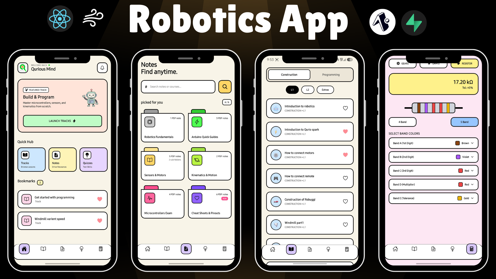

# 🤖 Qurious Mind

<p align="center">
  
</p>

<p align="center">
An educational robotics learning app built with <b>React Native</b> and <b>Expo</b>, designed to help students learn robotics through structured lessons, notes, quizzes, and engineering calculators.
</p>

## ✨ Features

- 📚 Structured Robotics Learning Tracks
- 📝 Searchable Notes & PDF Resources
- ❤️ Bookmark Favorite Lessons
- 🧠 Interactive Quizzes
- ⚡ Ohm's Law Calculator
- 🎨 4-Band & 5-Band Resistor Color Code Calculator
- 📱 Clean and Beginner-Friendly UI

---

## 🛠️ Tech Stack

- React Native
- Expo
- Expo Router
- TypeScript
- AsyncStorage

---

## 📂 Project Structure

```text
.
├── app/
├── assets/
├── store/
├── utils/
├── app.json
├── eas.json
├── package.json
└── README.md
```

---

## 🚀 Getting Started

Clone the repository

```bash
git clone https://github.com/your-username/quriousmind.git
```

Navigate to the project

```bash
cd quriousmind
```

Install dependencies

```bash
npm install
```

Start the Expo development server

```bash
npx expo start
```

---

## 📱 Build APK

```bash
eas build --platform android --profile preview
```

---

## 📄 License

This project is licensed under the MIT License.

---

## 👩‍💻 Developer

**Smriti Naik**

Built with ❤️ using React Native & Expo.
